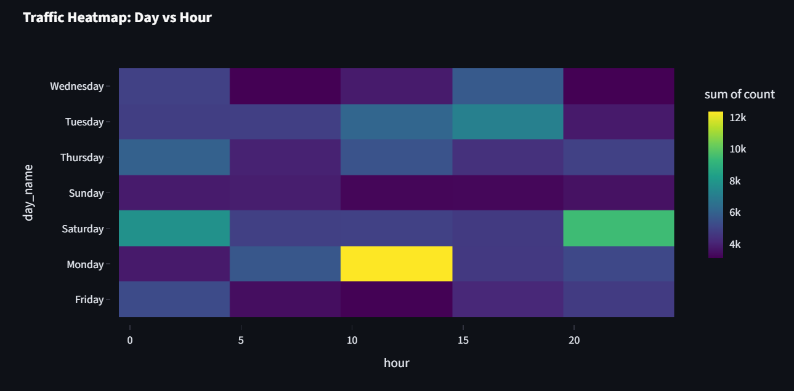

<h1 align="center">InsightX</h1>

InsightX is an industry-grade analytics dashboard designed to transform messy, unstructured server logs into actionable business intelligence. It automates data cleaning and uses Machine Learning to forecast sales and segment high-value customers.

📌 Project Overview

  Most e-commerce companies sit on gigabytes of raw log data but lack the tools to analyze it. InsightX solves this by:

  Ingesting raw logs (.xlsx or .csv) and cleaning them instantly.

  Visualizing traffic trends to identify peak server load times.

  Predicting future revenue using Random Forest regression.

  Clustering users into "VIPs" vs. "Window Shoppers" using K-Means.

✨ Key Features

   Executive Dashboard: Real-time KPIs for Revenue, Traffic, and Conversion Rates.

   ML Sales Forecasting: Predicts the next 30 days of sales trends.

   Smart Customer Segmentation: Automatically groups users based on behavior (browsing duration vs. spend).

   Geographic Intelligence: Maps top-performing countries and payment preferences.

   Traffic Heatmaps: Visualizes peak activity hours to optimize marketing campaigns.

🛠️ Tech Stack

  Frontend: Streamlit

  Data Processing: Pandas, NumPy, OpenPyXL

  Machine Learning: Scikit-Learn (RandomForest, KMeans)

  Visualization: Plotly Express

⚙️ How to Run

1.Clone the Repository

    git clone [https://github.com/YOUR_USERNAME/InsightX-Project.git](https://github.com/YOUR_USERNAME/InsightX-Project.git)
    cd InsightX-Project

2.Install Dependencies

    pip install -r requirements.txt

3.Add Your Data: Ensure your raw log file is in the main folder and named:

    E-commerce Website Logs.xlsx

4.Launch the Dashboard

    streamlit run insightx_app.py

📂 Project Structure

    InsightX-Project/
    ├── insightx_app.py       # Main Application & ML Logic
    ├── requirements.txt      # Dependencies
    ├── README.md             # Documentation
    └── E-commerce Website Logs.xlsx  # Data Source

Made for <strong>ASAP IDEA FEST - December 2025</strong>

